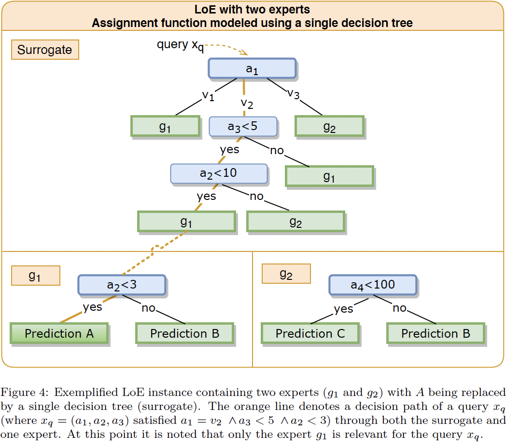

# RuleLoE
Rule LoE is a decision rule learning system. It is part of the LoE (League of Experts) framework. The main goal is to learn a set of rules which can be used to explain the predictions of a model. 
Rules are derived by combining a set of disjunct decision trees and estimating their competence area.
Rule GoN can under some circumstances simplify (connect) rules of same type to simpler rules. 

## Method
Having a set of `n` decision trees (HDTrees supported only), the method will train one (or optionally more) decision tree which learns to approximate the competence area (the specialization) of the each tree.
This is a `n`-class classification problem, where each class represents the competence area of a decision tree.
By then extending the path from this suorragate down to the leafs of the decision trees, a set of rules can be derived.

## Related repositories
This package *cannot* be used standalone, but is part of a bigger framework called LoE (League of Experts). The main repository can be found here
- [https://github.com/Mereep/HDTree](HDTree)
- [https://github.com/Mereep/loe](LoE)
- [https://github.com/Mereep/rule_loe](RuleLoE)